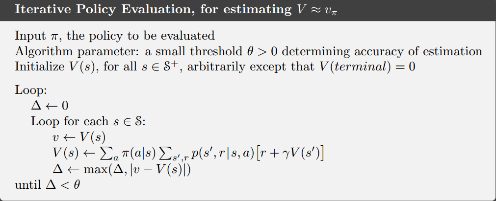
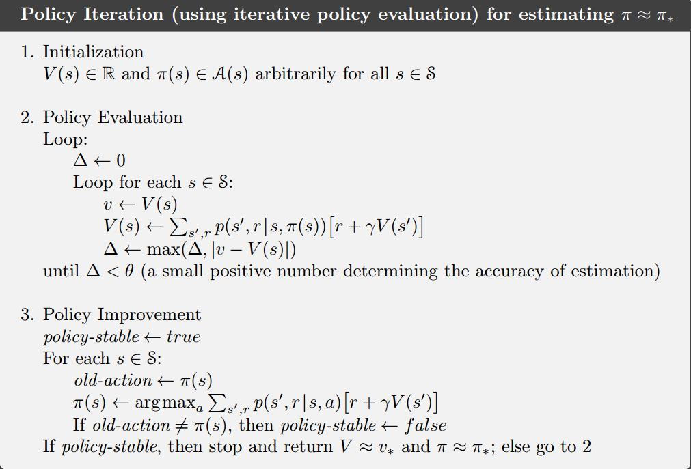
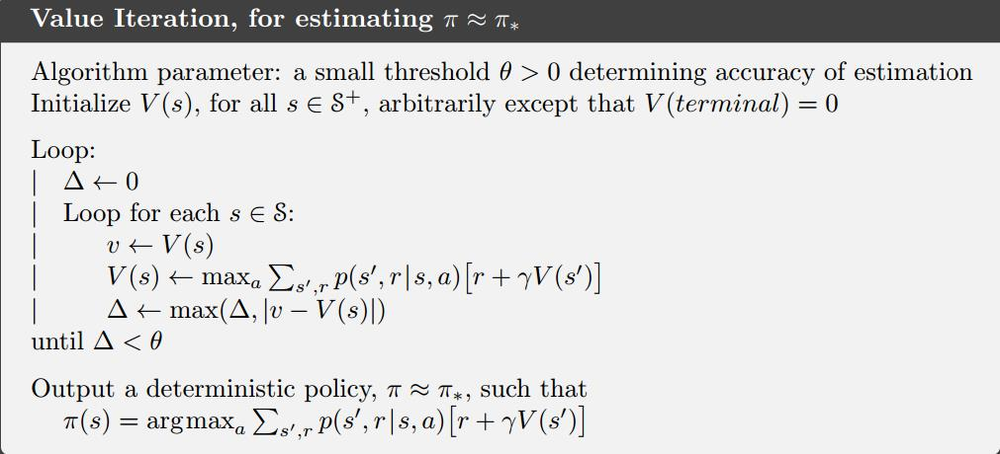
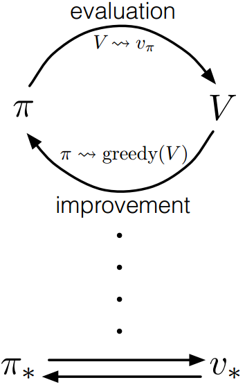
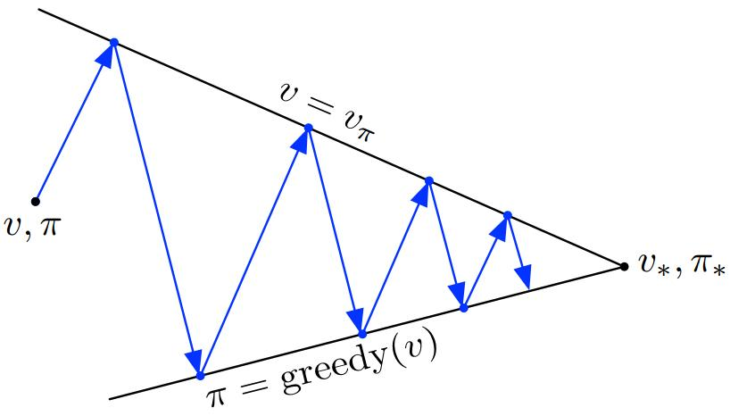
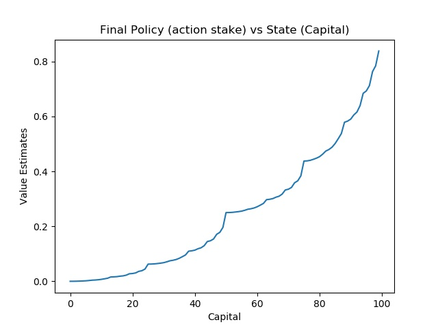
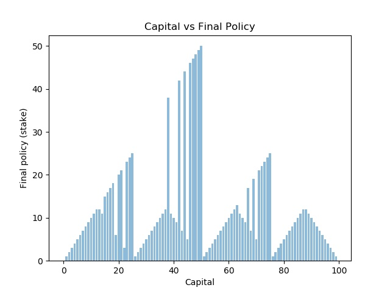

**强化学习理论学习与代码实现**

动态规划-基于模型的RL
=====================

动态规划(DP)这个术语指的是一组算法，它们可以在给定一个完美的环境模型作为马尔可夫决策过程(MDP)的情况下，用来计算最优策略。经典的DP算法假设模型是完美的，计算量大，在强化学习中应用有限，但在理论上仍然很重要。DP为理解后续将会介绍的方法提供了必要的基础。事实上，所有这些方法都可以被看作试图实现与DP几乎相同的效果，只是计算量更少，而且没有假设一个完美的环境模型。

DP和一般强化学习的核心思想是使用值函数来组织和构造对好策略的搜索。在本章中，我们将展示如何使用DP来计算值函数。正如前面所讨论的，一旦找到满足贝尔曼最优方程的最优值函数v\*或q\*，就可以很容易地获得最优策略：

（1）

或

（2）

对于所有的s∈S，a∈A(s)，s’∈S+。我们将看到，DP算法是通过将这些贝尔曼方程转化为赋值，也就是说，转化为改进期望值函数近似值的更新规则而得到的。

学习目标
--------

-   理解策略评估和处理改进之间区别，以及这些过程如何交互的；

-   理解策略迭代算法；

-   理解值迭代算法；

-   理解动态规划方法的局限性。

策略评估（预测）
----------------

首先，我们考虑如何计算任意策略π的状态值函数vπ，这在DP文献中被称为策略评估，我们也把它称为预测问题。回想上一章中，对于虽有的s∈S，

其中π(a\|s)是策略π在状态s下执行动作a的概率，带下标π的期望表示其以遵循的策略π为条件。只要满足γ\<1或者在策略π下，所有状态都会有终止状态，那么vπ就是存在且唯一的。

如果环境的动态转移特性是完全可知的，那么上式其实就是\|S\|个线性方程，带有\|S\|个未知数。原则上，可以进行直接求解，尽管有些繁琐。对于我们来说，迭代的计算方式是最适合的。假设我们有一系列的近似值函数v0,v1,v2...，每一个都把状态集合S+映射到实数集R。初始的近似值函数v0是任意选择的，然后后面的每一个近似值函数都使用vπ的贝尔曼方程（式（4））作为更新规则迭代求解。

（5）

显然vk=vπ是这个更新规则的不动点，因为vπ的Bellman方程保证了我们在这种情况下是相等的。因此随着k→∞，序列{vk}在保证vπ存在的条件下一般收敛到vπ。这种算法称为迭代策略评估。

为了从vk得到后续的每一个近似vk+1，迭代策略评估针对每个状态s进行相同的操作：把当前状态s的旧值更新成一个新值，这个新值是由状态s后一状态的旧值和期望即时奖励，在待评估策略下沿着所有可能的状态转移概率求和得到。我们把这个迭代操作叫做期望更新（expected
update）。迭代策略更新中的每次迭代都会更新一次所有的状态（full back
up，完全备份），以得到vk+1的近似值函数。期望更新有多种不同的方式，这取决于当前更新的是状态（此处）还是状态-动作对，以及后一状态的估计值合并的方式。在DP算法中完成的所有更新都叫做期望更新，是因为这些更新都基于所有可能的下一状态的期望，而不是采用后一状态。

如果你想写一个描述迭代策略评估的程序，那么你应该使用两个数组，其中一个保存旧值vk(s)，另一个保存新值vk+1(s)。这样的话，新值就可以在不改变旧值的情况下被一个个计算出来。当然只使用一个数组更容易，可以用“in
place”的方式更新值。这种方式下，某个状态更新后的值就会立即覆盖掉旧值。然后，根据状态更新的顺序，有时在式(5)的右边使用新值而不是旧值（可以这么理解：有时候恰好某个状态A的值更新较频繁，因为它与其他状态联系比较多，这样有可能下一次其他状态用到的A的值就是其更新两次或多次之后的）。“in
place”算法同样也会收敛到vπ，实际上通常其收敛速度快于使用两个数组的版本，因为一旦可用就使用某状态的新值。我们认为更新是在状态空间的扫描中完成的。对于“in
place”算法，状态值在扫描期间更新的顺序对收敛速度有显著影响。当我们考虑DP算法的时候，通常都考虑“in
place”形式。

虽然策略迭代评估最终肯定会收敛，但是实际程序中我们需要设置一个终止条件。一个典型的终止条件就是当maxs∈S
\|vk+1(s)-vk(s)\|的值非常小的时候，就让程序停止。

图1 迭代策略评估

策略改进
--------

计算策略值函数的目的就是寻找更优的策略。假设已经确定了任一确定性策略π的值函数vπ，那么对于某一状态s，我们想要知道是不是可以改变一下策略来确定性地选择一个动作a≠v(s)。我们已经知道在状态s遵循当前策略的好坏，即vπ(s)，但是变成新策略后是变好了呢还是变坏了呢？一种方法就是在s考虑选择a，之后遵循现有的策略π，此时value迭代如下：

（6）

关键标准是其是否大于vπ(s)，如果大于，说明在s选择a，之后遵循策略π会优于一直遵循策略π，那么在每次遇到状态s时仍然选择a会更好，新的策略在整体也更优。

这是一个称为策略改进定理（policy improvement
theorem）的一般结果的特殊情况。设π和π’任意确定策略对，对于所有s∈S，有

（7）

那么策略π’等同于或优于策略π，也就是说对于所有s∈S，其必会获得更大或相等的期望回报：

（8）

而且，在任意状态下，如果式（7）存在严格不等式，那么在对应状态式（8）也必然是严格不等式。

策略改进理论适应于两个策略，原始的确定性策略π和改变的策略π’，π’与π的区别仅仅在于π’(s)=a≠π(s)。对于除了s的状态，式（7）成立因为两边相等，因此如果qπ(s,a)\>
vπ(s)，那么改变的策略优于π。

从式（7）出发，不断使用式（6）分解qπ，然后重新应用式（7）直到得到vπ’(s)：

（9）

到目前为止，我们已经了解了如何在给定策略及其值函数的情况下，轻松地评估策略在单个状态下对特定动作的更改，很自然地可以考虑在所有状态下改变所有可能的动作，根据qπ(s,a)在每个状态选择看起来最好的动作。换句话说，考虑如下的贪婪策略：

（10）

贪婪策略根据vπ采取短期看起来（一步向前看）最优的动作，其满足式（7）策略改进理论的条件，所以可知其等同于或优于原始策略。通过使新策略对原策略的值函数贪婪，从而对原策略进行改进，这样制定新策略的过程称为策略改进（policy
improvement）。

假设新的贪婪策略π’和原策略π一样好，那么vπ’=vπ，根据式（10）对于所有s∈S，其满足：

（11）

这和贝尔曼最优方程是一样的，因此vπ’一定是v\*，π和π’都是最优策略。换句话说，策略改进一定会给我们一个更好地策略，除非我们当前的策略已经是最优的了。

策略迭代
--------

一旦一个策略π使用vπ得到了改进并得到了更优的策略π’，然后就可以计算vπ’，并再次对其进行改进从而得到更优的π’’，由此我们可以得到一个单调改进策略和值函数的序列：

（12）

其中带有E的箭头表示策略评估，带有I的箭头表示策略改进，每个策略都保证比前一个策略有严格的改进(除非它已经是最优的)。由于有限的MDP只有有限数量的策略，因此该过程必然在有限次迭代中收敛到最优策略和最优值函数。

这种寻找最优策略的方法称为策略迭代，下面给出了其完整的算法。注意，每个策略评估本身就是一个迭代计算，从前一个策略的值函数开始。这通常会大大提高策略评估的收敛速度(可能是因为值函数在策略之间变化不大)。

图2 策略迭代

值迭代
------

策略迭代的一个缺点是，它的每个迭代都包含策略评估，而策略评估本身可能是一个需要多次遍历状态集的冗长迭代计算。当然等到策略评估完成是好的，因为值函数会精确地收敛到vπ。我们必须等待到精确的收敛吗，或者我们能不能停下来？

实际上，可以采用多种方法截断策略迭代的策略评估步骤，而不丧失策略迭代的收敛性保证。其中一个特别的方式就是当所有状态都遍历一遍后，停止策略评估过程。这个算法就叫做值迭代（value
iteration）。可以将其写为一个结合了策略改进和截断策略评估的简单更新操作：

（13）

对于任意v0，序列{vk}在保证v\*存在的条件下可以收敛到v\*。

另外一个理解值迭代的方式是参考贝尔曼最优方程。我们注意到值迭代本质上是简单地把贝尔曼最优方程转化成一个更新规则，同意注意到值迭代的更新过程和之前的策略评估（式5）的过程是一模一样的，只是在值迭代过程中每次我们都需要所有动作中使得上式取最大值的那个。

最后，我们需要考虑一下值迭代如何终止。和策略评估相同，我们理论上需要无限次迭代使之精确收敛到v\*。在实际应用中，我们在相邻两次遍历状态的的差值非常小时，就停止运行。

图3 值迭代

我们可以看出，值迭代高效地结合了策略评估和策略改进，通过在每个策略改进遍历之间插入多个策略评估遍历，通常可以实现更快的收敛。总体来讲，一般来说，整类截断策略迭代算法都可以看作是遍历序列，其中一些使用策略评估更新，另一些使用值迭代更新。因为仅有的不同之处只是上式（13）中的max操作，这只意味着是把max操作加入了策略评估过程。所有这些算法对于折扣优先MDP来说都会收敛到最优策略。

异步动态规划
------------

到目前为止，我们讨论的DP算法的主要缺陷是我们必须在MDP的整个状态集上进行操作，即遍历状态集合。如果状态集数量非常大，那么就算是单次遍历也非常耗时。例如，西洋双陆棋有超过1020个状态，即使我们可以每秒对一百万个状态执行值迭代更新，完成一次遍历也需要超过一千年的时间。

异步DP算法是一种实时（in
place）迭代的DP算法，它不是系统地对状态集进行扫描的。这些算法以任何顺序，使用任何其他状态可用的值更新状态值。某些状态的值可能会在其他状态的值更新一次之前多次更新。然而，为了正确收敛，异步算法必须继续更新所有状态的值：它不能忽略计算中某个点之后的任何状态。异步DP算法允许选择要更新的状态，具有很大的灵活性。

例如，其中一种异步值迭代使用值迭代更新（式（13））在每个步骤k上只更新（in
place）一个状态sk的值。如果0\<γ\<1，只有在所有状态都在序列{sk}中无限次出现(序列甚至可以是随机的)的前提下，才能保证渐近收敛到v\*。(在非折扣的片段案例中，可能有一些更新顺序不会导致收敛，但相对容易避免这些情况。)类似地，可以将策略评估和值迭代更新混合使用，从而产生一种异步截断的策略迭代。

通用策略迭代
------------

策略迭代由两个同步的交互过程组成，一个使值函数与当前策略保持一致(策略评估)，另一个根据当前值函数给出贪婪策略(策略改进)。在策略迭代中，这两个流程交替进行，每个流程在另一个流程开始之前完成，但这并不是真正必要的。例如，在值迭代中，在每个策略改进之间只执行一次策略评估迭代。在异步DP方法中，评估和改进过程以更细的粒度交织在一起。在某些情况下，在返回到另一个过程之前，会在一个过程中仅更新一个状态。只要这两个过程持续更新所有状态，最终的结果通常是相同的—收敛到最优值函数和最优策略。

我们使用术语通用策略迭代(GPI)来表示允许策略评估和策略改进过程交互的一般思想，而不关注两个过程的粒度和其他细节。几乎所有的强化学习方法都可以用GPI来很好地描述，也就是说，它们都具有可识别的策略和值函数，策略总是根据值函数进行改进，并且值函数总是被驱动到策略的值函数，如图4所示。如果评价过程和改进过程都稳定下来，即不再产生变化，那么值函数和策略一定是最优的。值函数只有在与当前策略相一致时才稳定，而策略只有对当前价值函数贪婪时才稳定。因此，只有当发现策略对自己的评估函数贪婪时，这两个过程才会稳定下来，这说明贝尔曼最优方程成立，因此策略和值函数都是最优的。

图4 GPI

GPI的评估和改进过程可以看作是竞争和合作的过程。它们相互竞争的意义在于它们向相反的方向拉扯。使策略对值函数贪婪通常会否定当前值函数相对于改变后的策略的正确性，值函数进行更新使之和当前策略相一致，也就意味着当前的策略对于更新后的值函数来说，不再贪婪。然而，在长期交互作用中，这两个子过程却可以找到同一个最终答案：最优的策略和最优的值函数。

我们也可以将GPI中评估和改进过程之间的相互作用考虑为两个约束或目标，例如，就像图5所示的二维空间中的两条线。虽然实际的几何比这复杂得多，但该图显示了实际情况。每个过程都将值函数或策略驱动到直线（表示目标的解）的其中一条。目标相互作用是因为这两条线不是正交的，直接朝一个目标前进会导致远离另一个目标。然而，联合过程不可避免地更接近优化的总体目标。图中的箭头对应于策略迭代的行为，因为每个策略迭代都将系统带到完全实现两个目标中的一个。在GPI中，也可以朝着每个目标采取较小的、不完整的步骤。在这两种情况下，这两个过程一起实现了优化的总体目标，尽管它们都没有尝试直接实现优化。

图5 迭代过程

总结
----

动态规划(DP)方法假设我们有一个完美的环境马尔可夫决策过程(MDP)模型。在实践中通常不是这样，但无论如何研究DP是很重要的。

策略评估：计算给定策略的状态值函数v(s)。在DP中，这是使用“完全备份”来完成的。在每一种状态下，我们一步前向观察每一个可能的行动和下一个状态。我们之所以能做到这一点，是因为我们有一个完美的环境模型。

完全备份基本上是将Bellman方程转换为更新。

策略改进：给定策略的正确状态值函数，我们就可以对它采取贪婪的动作(即在每个状态中选择最佳动作)。然后我们就可以保证改进这个政策，或者已经是最优时保持不变。

策略迭代：迭代地执行策略评估和策略改进，直到达到最优策略。

值迭代：我们不需要执行多个策略评估步骤来找到“正确的”v(s)，而是只执行一步并立即改进策略。实际上，这个收敛得更快。

通用策略迭代：迭代地进行策略评估和改进的过程。我们可以为每个步骤选择不同的算法，但基本思想是相同的。

DP方法自举：它们基于其他估计更新估计(向前一步)。

练习
----

### 策略评估

import numpy as np  
import pprint  
import sys  
if "../" not in sys.path:  
sys.path.append("../")  
from Lib.envs.gridworld import GridworldEnv  
  
env = GridworldEnv()  
  
def policy_eval(policy, env, discount_factor=1.0, theta=0.00001):  
*"""*  
*给定环境及环境动态完整描述的情况下，评估策略*  
*参数:*  
*policy: [S, A] 表达策略的矩阵，给定在状态S下采取动作A的概率.*  
*env: OpenAI env. env.P 表达了环境的状态转移概率.*  
*env.P[s][a] 是转移数组(prob, next_state, reward, done)的列表.*  
*env.nS 是环境中的状态数量.*  
*env.nA 是环境中的动作数量.*  
*theta: 对于所有的状态，一旦值函数的变化小于该参数则停止评估.*  
*discount_factor: Gamma折扣因子.*  
  
*返回值:*  
*长度为env.nS的向量，表示值函数.*  
*"""*  
\# 初始为随机值函数（均为0）  
V = np.zeros(env.nS)  
while True:  
delta = 0  
\# 对于每一个状态，执行完整备份  
for s in range(env.nS):  
v = 0  
\# 观察所有可能的下一动作  
for a, action_prob in enumerate(policy[s]):  
\# 对于每一个动作，观察其可能的下一状态  
for prob, next_state, reward, done in env.P[s][a]:  
\# 计算期望值函数.  
v += action_prob \* prob \* (reward + discount_factor \* V[next_state])  
\# 值函数的改变量  
delta = max(delta, np.abs(v - V[s]))  
V[s] = v  
\# 一旦值函数的改变量小于阈值，则停止评估  
if delta \< theta:  
break  
return np.array(V)  
  
random_policy = np.ones([env.nS, env.nA]) / env.nA  
v = policy_eval(random_policy, env)  
  
print("值函数:")  
print(v)  
print("")  
  
print("Reshaped Grid Value Function:")  
print(v.reshape(env.shape))  
print("")

结果如下：

值函数:

[ 0. -13.99993529 -19.99990698 -21.99989761 -13.99993529

\-17.9999206 -19.99991379 -19.99991477 -19.99990698 -19.99991379

\-17.99992725 -13.99994569 -21.99989761 -19.99991477 -13.99994569

0. ]

Reshaped Grid Value Function:

[[ 0. -13.99993529 -19.99990698 -21.99989761]

[-13.99993529 -17.9999206 -19.99991379 -19.99991477]

[-19.99990698 -19.99991379 -17.99992725 -13.99994569]

[-21.99989761 -19.99991477 -13.99994569 0. ]]

### 策略迭代

import numpy as np  
import pprint  
import sys  
if "../" not in sys.path:  
sys.path.append("../")  
from Lib.envs.gridworld import GridworldEnv  
  
env = GridworldEnv()  
  
def policy_eval(policy, env, discount_factor=1.0, theta=0.00001):  
*"""*  
*给定环境及环境动态完整描述的情况下，评估策略*  
*参数:*  
*policy: [S, A] 表达策略的矩阵，给定在状态S下采取动作A的概率.*  
*env: OpenAI env. env.P 表达了环境的状态转移概率.*  
*env.P[s][a] 是转移数组(prob, next_state, reward, done)的列表.*  
*env.nS 是环境中的状态数量.*  
*env.nA 是环境中的动作数量.*  
*theta: 对于所有的状态，一旦值函数的变化小于该参数则停止评估.*  
*discount_factor: Gamma折扣因子.*  
  
*返回值:*  
*长度为env.nS的向量，表示值函数.*  
*"""*  
\# 初始为随机值函数（均为0）  
V = np.zeros(env.nS)  
while True:  
delta = 0  
\# 对于每一个状态，执行完整备份  
for s in range(env.nS):  
v = 0  
\# 观察所有可能的下一动作  
for a, action_prob in enumerate(policy[s]):  
\# 对于每一个动作，观察其可能的下一状态  
for prob, next_state, reward, done in env.P[s][a]:  
\# 计算期望值函数.  
v += action_prob \* prob \* (reward + discount_factor \* V[next_state])  
\# 值函数的改变量  
delta = max(delta, np.abs(v - V[s]))  
V[s] = v  
\# 一旦值函数的改变量小于阈值，则停止评估  
if delta \< theta:  
break  
return np.array(V)  
  
  
def policy_improvement(env, policy_eval_fn=policy_eval, discount_factor=1.0):  
*"""*  
*策略改进算法。迭代评估和改进策略，直到找到最优策略.*  
  
*参数:*  
*env: 网格世界环境.*  
*policy_eval_fn: 策略评估函数（3个参数:policy, env, discount_factor）*  
*discount_factor: gamma折扣因子.*  
  
*返回值:*  
*一个数组(policy, V).*  
*policy是最优策略，为形状为[S,
A]的矩阵，其中每一个状态s包含了其可选动作的概率分布.*  
*V是最优策略的值函数.*  
  
*"""*  
  
def one_step_lookahead(state, V):  
*"""*  
*用于计算给定状态下所有可选动作的值.*  
  
*参数:*  
*state:所关注的状态(整型)*  
*V: 估计值，长度为env.nS的向量*  
  
*返回值:*  
*长度为env.nA的向量，包含了每一个动作的期望值.*  
*"""*  
A = np.zeros(env.nA)  
for a in range(env.nA):  
for prob, next_state, reward, done in env.P[state][a]:  
A[a] += prob \* (reward + discount_factor \* V[next_state])  
return A  
  
\# 初始为随机策略  
policy = np.ones([env.nS, env.nA]) / env.nA  
  
while True:  
\# 评估当前策略  
V = policy_eval_fn(policy, env, discount_factor)  
  
\# 如果对策略做了任何改变则设置为false  
policy_stable = True  
  
\# 对每一个状态...  
for s in range(env.nS):  
\# 当前策略下采取最优动作  
chosen_a = np.argmax(policy[s])  
  
\# 通过一步前向观察找到最优动作  
\# 如果有多个最优，则任意选择  
action_values = one_step_lookahead(s, V)  
best_a = np.argmax(action_values)  
  
\# 贪婪更新策略  
if chosen_a != best_a:  
policy_stable = False  
policy[s] = np.eye(env.nA)[best_a]  
  
\# 如果策略稳定，则已找到最优策略，并返回  
if policy_stable:  
return policy, V  
  
policy, v = policy_improvement(env)  
print("Policy Probability Distribution:")  
print(policy)  
print("")  
  
print("Reshaped Grid Policy (0=up, 1=right, 2=down, 3=left):")  
print(np.reshape(np.argmax(policy, axis=1), env.shape))  
print("")  
  
print("Value Function:")  
print(v)  
print("")  
  
print("Reshaped Grid Value Function:")  
print(v.reshape(env.shape))  
print("")

结果如下：

Policy Probability Distribution:

[[1. 0. 0. 0.]

[0. 0. 0. 1.]

[0. 0. 0. 1.]

[0. 0. 1. 0.]

[1. 0. 0. 0.]

[1. 0. 0. 0.]

[1. 0. 0. 0.]

[0. 0. 1. 0.]

[1. 0. 0. 0.]

[1. 0. 0. 0.]

[0. 1. 0. 0.]

[0. 0. 1. 0.]

[1. 0. 0. 0.]

[0. 1. 0. 0.]

[0. 1. 0. 0.]

[1. 0. 0. 0.]]

Reshaped Grid Policy (0=up, 1=right, 2=down, 3=left):

[[0 3 3 2]

[0 0 0 2]

[0 0 1 2]

[0 1 1 0]]

Value Function:

[ 0. -1. -2. -3. -1. -2. -3. -2. -2. -3. -2. -1. -3. -2. -1. 0.]

Reshaped Grid Value Function:

[[ 0. -1. -2. -3.]

[-1. -2. -3. -2.]

[-2. -3. -2. -1.]

[-3. -2. -1. 0.]]

### 值迭代

import numpy as np  
import pprint  
import sys  
if "../" not in sys.path:  
sys.path.append("../")  
from Lib.envs.gridworld import GridworldEnv  
  
env = GridworldEnv()  
  
  
def value_iteration(env, theta=0.0001, discount_factor=1.0):  
*"""*  
*值函数迭代算法.*  
  
*参数:*  
*env: OpenAI env. env.P 表达了环境的状态转移概率.*  
*env.P[s][a] 是转移数组(prob, next_state, reward, done)的列表.*  
*env.nS 是环境中的状态数量.*  
*env.nA 是环境中的动作数量.*  
*theta: 对于所有的状态，一旦值函数的变化小于该参数则停止评估.*  
*discount_factor: Gamma折扣因子.*  
  
*返回值:*  
*最优策略和最优值函数构成的数组(policy, V).*  
*"""*  
  
V = np.zeros(env.nS)  
policy = np.zeros([env.nS, env.nA])  
  
def one_step_lookahead(state, V):  
*"""*  
*用于计算给定状态下所有可选动作的值.*  
  
*参数:*  
*state:所关注的状态(整型)*  
*V: 估计值，长度为env.nS的向量*  
  
*返回值:*  
*长度为env.nA的向量，包含了每一个动作的期望值.*  
*"""*  
A = np.zeros(env.nA)  
for a in range(env.nA):  
for prob, next_state, reward, done in env.P[state][a]:  
A[a] += prob \* (reward + discount_factor \* V[next_state])  
return A  
  
V = np.zeros(env.nS)  
while True:  
\# 停止准则  
delta = 0  
\# 更新每个状态...  
for s in range(env.nS):  
\# 执行一步前向观察，找到最优动作  
A = one_step_lookahead(s, V)  
best_action_value = np.max(A)  
\# 在经历过的所有状态中计算delta  
delta = max(delta, np.abs(best_action_value - V[s]))  
\# 更新值函数  
V[s] = best_action_value  
\# 检查是否停止  
if delta \< theta:  
break  
  
\# 使用最优值函数创建确定性策略  
policy = np.zeros([env.nS, env.nA])  
for s in range(env.nS):  
\# 使用一步前向观察为该状态寻找最优动作  
A = one_step_lookahead(s, V)  
best_action = np.argmax(A)  
\# 总是采取最优动作  
policy[s, best_action] = 1.0  
  
return policy, V  
  
policy,v=value_iteration(env)  
  
print("策略概率分布：")  
print(policy)  
print("")  
  
print("重变形状的网格策略（0=up,1=right,2=down,3=left）")  
print(np.reshape(np.argmax(policy,axis=1),env.shape))  
print("")  
  
print("值函数：")  
print(v)  
print("")  
  
print("重变 形状的网格值函数：")  
print(v.reshape(env.shape))  
print("")

结果如下：

策略概率分布：

[[1. 0. 0. 0.]

[0. 0. 0. 1.]

[0. 0. 0. 1.]

[0. 0. 1. 0.]

[1. 0. 0. 0.]

[1. 0. 0. 0.]

[1. 0. 0. 0.]

[0. 0. 1. 0.]

[1. 0. 0. 0.]

[1. 0. 0. 0.]

[0. 1. 0. 0.]

[0. 0. 1. 0.]

[1. 0. 0. 0.]

[0. 1. 0. 0.]

[0. 1. 0. 0.]

[1. 0. 0. 0.]]

重变形状的网格策略（0=up,1=right,2=down,3=left）

[[0 3 3 2]

[0 0 0 2]

[0 0 1 2]

[0 1 1 0]]

值函数：

[ 0. -1. -2. -3. -1. -2. -3. -2. -2. -3. -2. -1. -3. -2. -1. 0.]

重变 形状的网格值函数：

[[ 0. -1. -2. -3.]

[-1. -2. -3. -2.]

[-2. -3. -2. -1.]

[-3. -2. -1. 0.]]

### 赌徒问题

A gambler has the opportunity to make bets on the outcomes of a sequence of coin
flips. If the coin comes up heads, he wins as many dollars as he has staked on
that flip; if it is tails, he loses his stake. The game ends when the gambler
wins by reaching his goal of \$100, or loses by running out of money.

On each flip, the gambler must decide what portion of his capital to stake, in
integer numbers of dollars. This problem can be formulated as an undiscounted,
episodic, finite MDP.

The state is the gambler’s capital, s ∈ {1, 2, . . . , 99}. The actions are
stakes, a ∈ {0, 1, . . . , min(s, 100 − s)}. The reward is zero on all
transitions except those on which the gambler reaches his goal, when it is +1.

The state-value function then gives the probability of winning from each state.
A policy is a mapping from levels of capital to stakes. The optimal policy
maximizes the probability of reaching the goal. Let p_h denote the probability
of the coin coming up heads. If p_h is known, then the entire problem is known
and it can be solved, for instance, by value iteration.

import sys  
import matplotlib.pyplot as plt  
import numpy as np  
  
if "../" not in sys.path:  
sys.path.append("../")  
  
  
def value_iteration_for_gamblers(p_h, theta=0.0001, discount_factor=1.0):  
*"""*  
*参数:*  
*p_h: 硬币朝上的概率*  
*"""*  
\# 只有当达到目标时奖励才是+1，其他转移均为0.  
rewards = np.zeros(101)  
rewards[100] = 1  
  
\# 引入两个虚拟状态，分别对应奖金为0和100时终止  
V = np.zeros(101)  
  
def one_step_lookahead(s, V, rewards):  
*"""*  
*用于计算给定状态下所有可选动作的值.*  
  
*参数:*  
*s:赌徒的资金(整型)*  
*V: 每个状态的值构成的向量*  
*rewards:奖励向量*  
  
*返回值:*  
*长度为env.nA的向量，包含了每一个动作的期望值.*  
*"""*  
A = np.zeros(101)  
stakes = range(1, min(s, 100 - s) + 1) \# 最小下注为1, 最大下注为min(s, 100-s).  
for a in stakes:  
\# 奖励[s+a]和[s-a]为即时奖励.  
\# V[s+a]和V[s-a]为下一状态的值.  
\# 贝尔曼方程：动作的期望值为即时奖励与下一状态值函数的和.  
A[a] = p_h \* (rewards[s + a] + V[s + a] \* discount_factor) + (1 - p_h) \* (  
rewards[s - a] + V[s - a] \* discount_factor)  
return A  
  
while True:  
\# 停止准则  
delta = 0  
\# 更新每个状态...  
for s in range(1, 100):  
\# 执行一步前向观察以找到最优动作  
A = one_step_lookahead(s, V, rewards)  
best_action_value = np.max(A)  
\# 计算经历过的所有的状态的delta  
delta = max(delta, np.abs(best_action_value - V[s]))  
\# 更新值函数  
V[s] = best_action_value  
\# 检查是否停止  
if delta \< theta:  
break  
  
\# 使用最优值函数创建确定性策略  
policy = np.zeros(100)  
for s in range(1, 100):  
\# 使用一步前向观察为该状态寻找最优动作  
A = one_step_lookahead(s, V, rewards)  
best_action = np.argmax(A)  
\# 总是采取最优动作  
policy[s] = best_action  
  
return policy, V  
  
  
policy, v = value_iteration_for_gamblers(0.25)  
print("Optimized Policy:")  
print(policy)  
print("")  
  
print("Optimized Value Function:")  
print(v)  
print("")  
  
\# x axis values  
x = range(100)  
\# corresponding y axis values  
y = v[:100]  
  
\# plotting the points  
plt.plot(x, y)  
  
\# naming the x axis  
plt.xlabel('Capital')  
\# naming the y axis  
plt.ylabel('Value Estimates')  
  
\# giving a title to the graph  
plt.title('Final Policy (action stake) vs State (Capital)')  
  
\# function to show the plot  
plt.show()  
  
Plotting  
Capital  
vs  
Final  
Policy  
  
\# x axis values  
x = range(100)  
\# corresponding y axis values  
y = policy  
  
\# plotting the bars  
plt.bar(x, y, align='center', alpha=0.5)  
  
\# naming the x axis  
plt.xlabel('Capital')  
\# naming the y axis  
plt.ylabel('Final policy (stake)')  
  
\# giving a title to the graph  
plt.title('Capital vs Final Policy')  
  
\# function to show the plot  
plt.show()

结果为：

Optimized Policy:

[ 0. 1. 2. 3. 4. 5. 6. 7. 8. 9. 10. 11. 12. 12. 11. 15. 16. 17.

18. 6. 20. 21. 3. 23. 24. 25. 1. 2. 3. 4. 5. 6. 7. 8. 9. 10.

11. 12. 38. 11. 10. 9. 42. 7. 44. 5. 46. 47. 48. 49. 50. 1. 2. 3.

4. 5. 6. 7. 8. 9. 10. 11. 12. 13. 11. 10. 9. 17. 7. 19. 5. 21.

22. 23. 24. 25. 1. 2. 3. 4. 5. 6. 7. 8. 9. 10. 11. 12. 12. 11.

10. 9. 8. 7. 6. 5. 4. 3. 2. 1.]

Optimized Value Function:

[0.00000000e+00 7.24792480e-05 2.89916992e-04 6.95257448e-04

1.16010383e-03 1.76906586e-03 2.78102979e-03 4.03504074e-03

4.66214120e-03 5.59997559e-03 7.08471239e-03 9.03964043e-03

1.11241192e-02 1.56793594e-02 1.61464431e-02 1.69517994e-02

1.86512806e-02 1.98249817e-02 2.24047303e-02 2.73845196e-02

2.83388495e-02 3.04937363e-02 3.61633897e-02 3.84953022e-02

4.44964767e-02 6.25000000e-02 6.27174377e-02 6.33700779e-02

6.45857723e-02 6.59966059e-02 6.78135343e-02 7.08430894e-02

7.46098323e-02 7.64884604e-02 7.93035477e-02 8.37541372e-02

8.96225423e-02 9.58723575e-02 1.09538078e-01 1.10939329e-01

1.13360151e-01 1.18457374e-01 1.21977661e-01 1.29716907e-01

1.44653559e-01 1.47520113e-01 1.53983246e-01 1.70990169e-01

1.77987434e-01 1.95990576e-01 2.50000000e-01 2.50217438e-01

2.50870078e-01 2.52085772e-01 2.53496606e-01 2.55313534e-01

2.58343089e-01 2.62109832e-01 2.63988460e-01 2.66803548e-01

2.71254137e-01 2.77122542e-01 2.83372357e-01 2.97038078e-01

2.98439329e-01 3.00860151e-01 3.05957374e-01 3.09477661e-01

3.17216907e-01 3.32153559e-01 3.35020113e-01 3.41483246e-01

3.58490169e-01 3.65487434e-01 3.83490576e-01 4.37500000e-01

4.38152558e-01 4.40122454e-01 4.43757317e-01 4.47991345e-01

4.53440603e-01 4.62529268e-01 4.73829497e-01 4.79468031e-01

4.87912680e-01 5.01265085e-01 5.18867627e-01 5.37617932e-01

5.78614419e-01 5.82817988e-01 5.90080452e-01 6.05372123e-01

6.15934510e-01 6.39150720e-01 6.83960814e-01 6.92560339e-01

7.11950883e-01 7.62970611e-01 7.83963162e-01 8.37972371e-01

0.00000000e+00]

